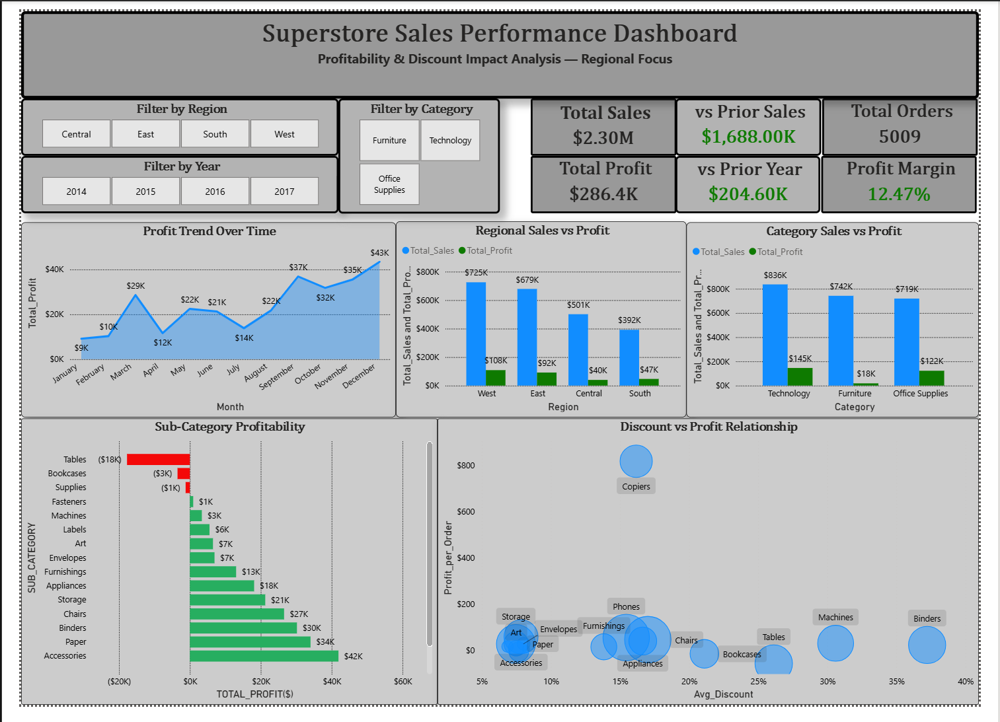
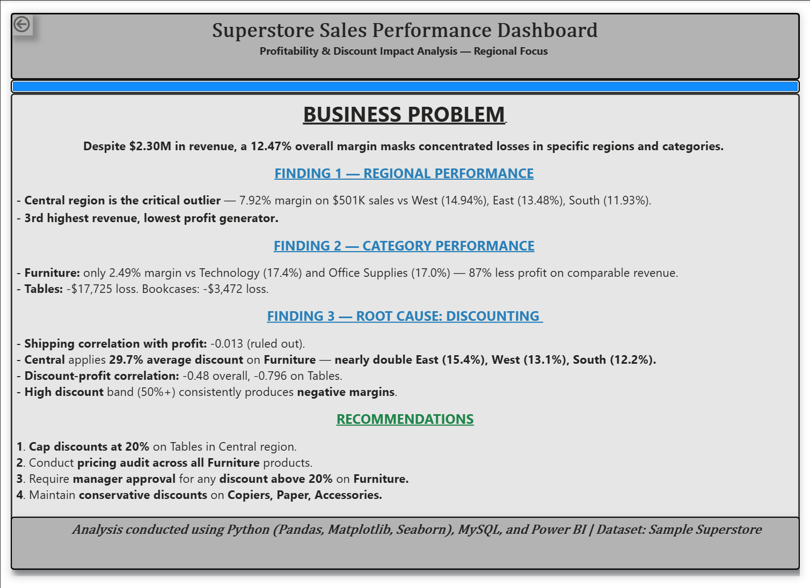

# Superstore Profitability & Discount Impact Analysis

**Tools Used:** Python (Pandas, Matplotlib, Seaborn) | MySQL | Power BI  
**Dataset:** [Sample Superstore — Kaggle](https://www.kaggle.com/datasets/vivek468/superstore-dataset-final)  
**Project Type:** End-to-end Exploratory Data Analysis.

## Business Problem

A retail company generating $2.30M in revenue maintains a 12.47% overall 
profit margin — but this figure masks significant losses concentrated in 
specific regions, categories, and sub-categories.

This project investigates **where** the losses occur, **why** they occur, 
and provides **data-driven recommendations** to improve profitability.

| Component | File | Description |
|---|---|---|
| Python EDA | `/python/Py_Superstore_Analysis.ipynb` | Data cleaning, visualisation, correlation analysis |
| SQL Analysis | `/sql/Super_Store_Analysis.sql` | Regional, category, and discount analysis using MySQL |
| Dashboard | `/dashboard/superstore_analysis_BI.pbix` | Interactive Power BI dashboard with findings |

---

## Key Findings

**1. Regional Performance**  
Central region is the critical outlier — 7.92% profit margin on $501K 
in sales vs West (14.94%), East (13.48%), South (11.93%). 
It is the 3rd highest revenue region but the lowest profit generator.

**2. Category Performance**  
Furniture generates only 2.49% profit margin compared to Technology 
(17.4%) and Office Supplies (17.0%) — 87% less profit on comparable revenue.  
Within Furniture: Tables generate -$17,725 in losses, Bookcases -$3,472.

**3. Root Cause — Discounting**  
Shipping duration showed near-zero correlation (-0.013) with profit, 
ruling out logistics as a factor.  
Central region applies a 29.7% average discount on Furniture — nearly 
double East (15.4%), West (13.1%), and South (12.2%).  
Discount-profit correlation: -0.48 overall, -0.796 specifically on Tables.

**4. Discount Band Analysis**  
Orders in the High Discount band (50%+) consistently produce negative 
profit margins, confirming excessive discounting as the primary driver 
of financial losses.

---

## Recommendations

1. **Cap discounts at 20%** on Tables in the Central region
2. **Conduct a pricing audit** across all Furniture products
3. **Require manager approval** for any discount above 20% on Furniture
4. **Maintain conservative discounts** on high-performing sub-categories 
   — Copiers, Paper, and Accessories

---

## Dashboard Preview

### Page 1 — Main Dashboard

### Page 2 — Key Findings

---

## SQL Techniques Demonstrated

- Aggregations and GROUP BY across multiple dimensions
- Subquery for identifying below-average profit products
- Window Function — RANK() OVER(PARTITION BY) for top losses per region
- CTE (Common Table Expression) for discount analysis
- CASE statement for discount band segmentation
- Running cumulative profit using nested window functions
- Date formatting and type conversion from VARCHAR to DATE

---

## Python Techniques Demonstrated

- Data cleaning — datetime conversion, null checks, duplicate checks
- Calculated field creation — Profit Margin, Shipping Duration
- GroupBy aggregations across Region, Category, Sub-Category
- Correlation analysis — Pearson correlation for discount vs profit
- Visualisations — bar charts, scatter plots with conditional colouring

---

## How to Run

**Python Notebook:**
1. Download the Superstore dataset from Kaggle (link above)
2. Open `/python/Py_Superstore_Analysis.ipynb`  in Jupyter Notebook
3. Update the file path in Cell 7 to your local CSV location
4. Run all cells

**SQL:**
1. Open MySQL Workbench
2. Run `/sql/Super_Store_Analysis.sql`
3. Import the Superstore CSV using the LOAD DATA instructions 
   commented at the top of the file

**Dashboard:**
1. Open `/dashboard/superstore_analysis_BI.pbix` in Power BI Desktop
2. Update the data source path if prompted

---

*Analysis conducted as part of a data analyst portfolio project.*

